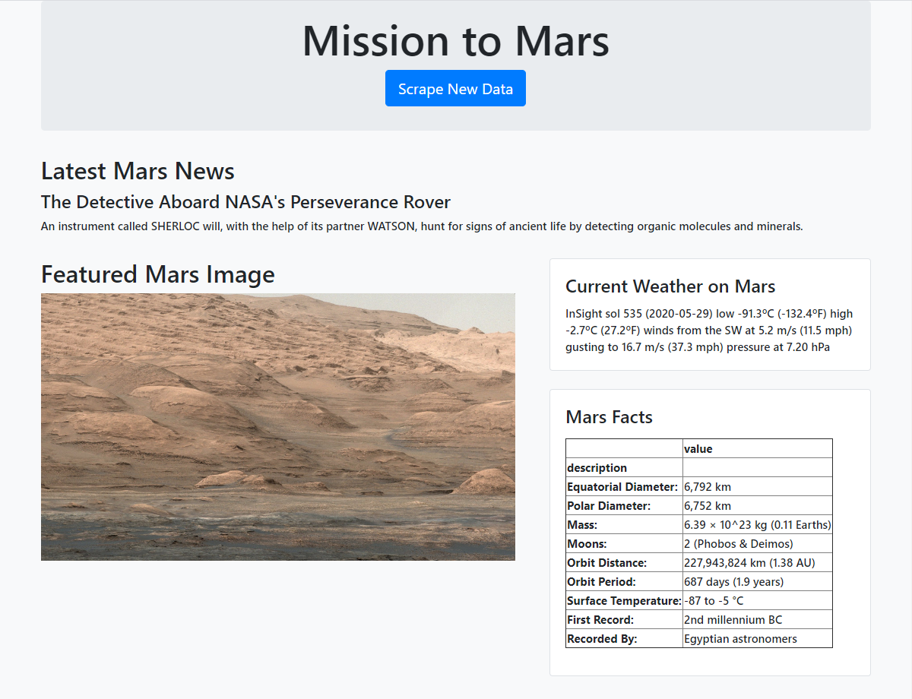
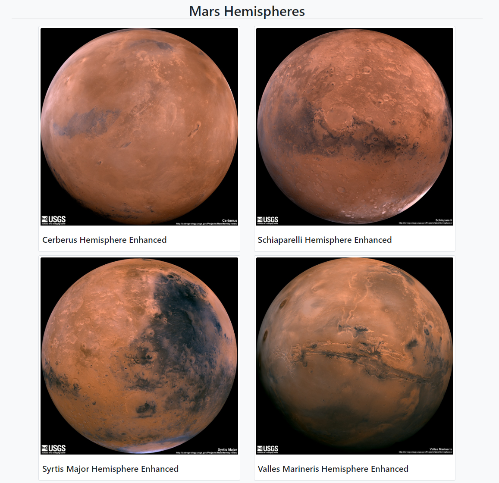

# Mission to Mars

### Objective

In this project we built a web application that scrapes various websites for data related to the Mission to Mars and displays the information in a single HTML page. 

#### 1. Scraping

A Jupyter Notebook file, called *mission_to_mars.ipynb*, was created and used to complete all of the  scraping and analysis tasks, using BeautifulSoup, Pandas, and Requests/Splinter.

##### NASA Mars News

- I scraped the [NASA Mars News Site](https://mars.nasa.gov/news/) and collected the latest News Title and Paragraph Text, and assigned them to variables to reference later.

##### JPL Mars Space Images - Featured Image

- Splinter was used to navigate the  [JPL Featured Space Image](https://www.jpl.nasa.gov/spaceimages/?search=&category=Mars) site and find the image url for the current Featured Mars Image (full size .jpg image) and assign the complete url string to a variable.

##### Mars Weather

- The latest Mars weather tweet, from the the [Mars Weather twitter account](https://twitter.com/marswxreport?lang=en) page, was scraped and the tweet text for the weather report was saved as a variable.

##### Mars Facts

- Pandas was used to scrape the table containing facts about the planet including Diameter, Mass, etc. on the [Mars Facts webpage](https://space-facts.com/mars/) and to convert the data to a HTML table string.

##### Mars Hemispheres

- High resolution images for each of Mar's hemispheres were obtained on the [USGS Astrogeology site](https://astrogeology.usgs.gov/search/results?q=hemisphere+enhanced&k1=target&v1=Mars).
- The image url string for the full resolution hemisphere image, and the Hemisphere title containing the hemisphere name were both saved in a Python dictionary using the keys img_url and title.

- The dictionary was then appended to a list that contained one dictionary for each hemisphere.

#### 2. MongoDB and Flask Application

MongoDB with Flask templating was used to create a new HTML page that displays all of the information that was scraped from the URLs above.

- The Jupyter notebook was converted into a Python script called `scrape_mars.py` with a function called `scrape` that would execute all of the scraping code from above and return one Python dictionary containing all of the scraped data.
- Next, a route called `/scrape` was created that would import the `scrape_mars.py` script and call the `scrape` function. Store The return value was stored in Mongo as a Python dictionary.
- A root route `/` was created that would query the Mongo database and pass the mars data into an HTML template to display the data.
- A template HTML file called `index.html`was created. It would take the mars data dictionary and display all of the data in the appropriate HTML elements. Bootstrap was used to structure the HTML template.

### Running

Make sure that you have the `chromedriver.exe` that fits the Chrome version before you run `app.py`.

### Tools / Techniques Used:

- Python
- BeatifulSoup
- Splinter
- Pandas
- chromedriver
- Flask
- MongoDB
- PyMongo
- HTML5 / CSS
- Bootstrap4

### Example of Results

